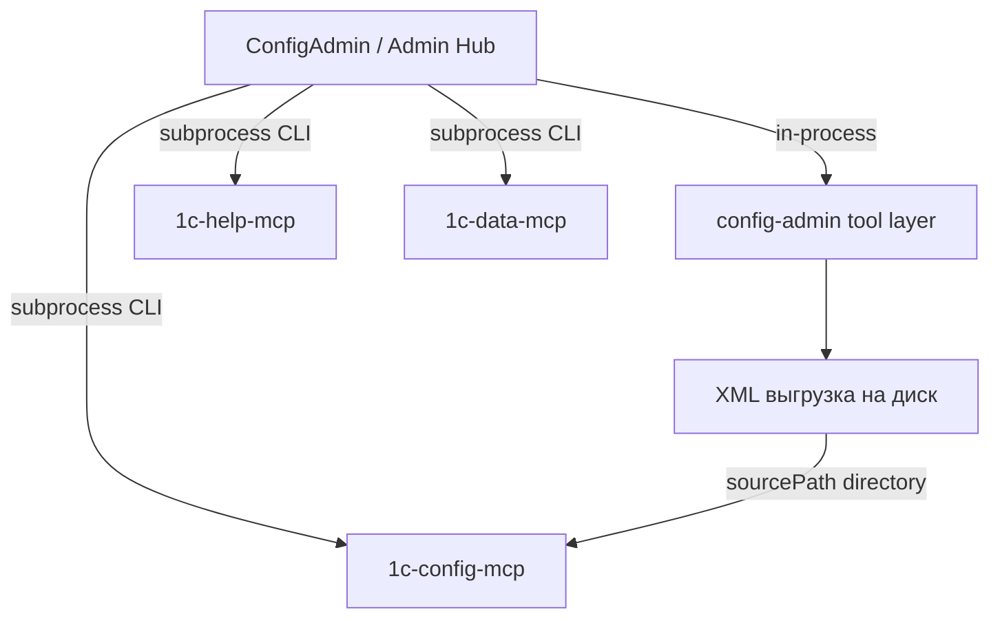
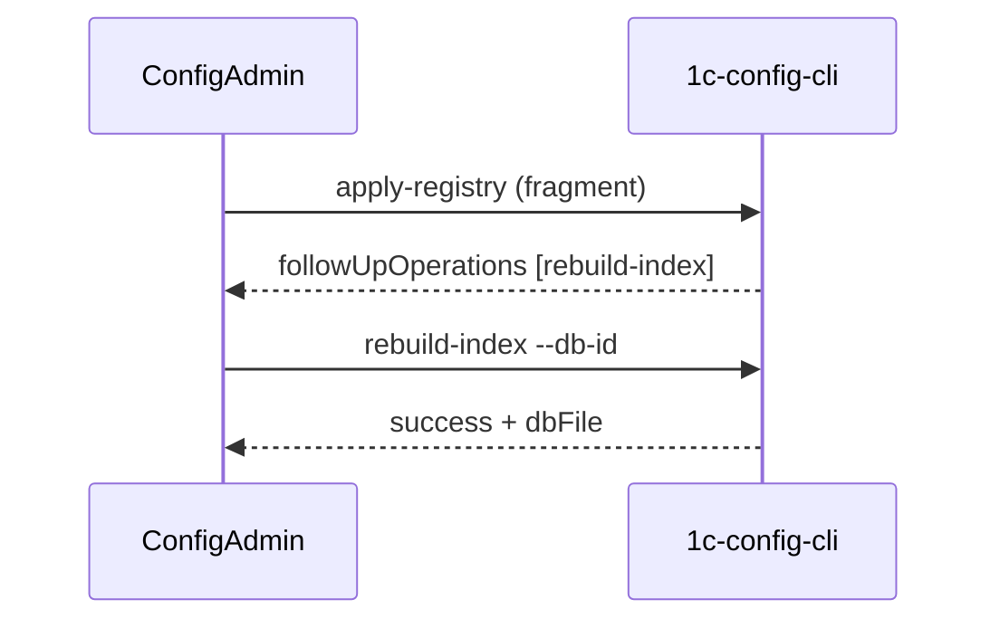

## Интеграция с Admin Hub (ConfigAdmin)


### Статус


- **Протокол:** v1 + addendum v1.0.1 + v1.0.2 (см. [`protocol-v1.md`](protocol-v1.md) и addendum в этом каталоге).

- **Роль:** ConfigAdmin = **Admin Hub implementation** + managed tool `config-admin` (v1.0.2 §1, §12).

- **config-mcp Phase 1 (ConfigAdmin side):** **готово** — Hub tables в SQLite, экран MCP, sync через `apply-registry`, post-export sync, instance-level linking.

- **config-mcp Phase 3 CLI (P0):** **готово** (2026-06-29) — `rebuild-index`, `rebuild-all`, `reconcile-markers`, `apply-registry --trigger-rebuild`; `indexReadiness` в `status --json`. Канон в репозитории config-mcp: `docs/admin-hub/integration.md` § Phase 3 CLI.

- **Hub H6 orchestration:** **готово** (2026-06-30) — автоматический `rebuild-index` после `apply-registry` (export / sync / экран MCP). **E2E проверено:** новое расширение → выгрузка → индекс `.db` → видно в MCP.

- **Planned-path привязка до выгрузки:** **готово** — `ConfigMcpProjectsJsonMerger` пишет `projects.json`, если CLI пропустил database из‑за отсутствия каталога; UTF-8 с читаемой кириллицей.

- **Registry mapping (Hub ↔ config-mcp):** **согласовано 2026-06-28** — см. [`registry-mapping.md`](registry-mapping.md).

- **ConfigAdmin protocol CLI** (inventory/status/export-registry для самого Hub): не начато.

- **Режим по умолчанию:** standalone; `managed` — после явной настройки manifest.


### Роль в экосистеме





**ConfigAdmin** (`moduleType: config-admin`):


- выгрузка конфигурации и расширений в XML;

- хранение профилей клиентов/баз в `configadmin.db`;

- canonical Hub registry (clients, projects, infobases, tool_instances, links) — по v1.0.2;

- orchestration headless-операций внешних MCP (config-mcp: inventory/status/apply-registry).


MCP-модули остаются отдельными portable instances; интеграция — manifest + CLI, не merge codebase.


### Принципы разработки


1. **Minimum invasive unification** — расширять `ConfigAdmin.Console` и `Application/Hub/`, не переписывать `ExportOrchestrator`.

2. **CLI entrypoint** — существующий `configadmin.exe`, без нового exe.

3. **In-process для себя** — Hub-операции ConfigAdmin через DI/services; MCP — subprocess (v1.0.2 §6).

4. **GUI не центр интеграции** — WPF для человека; Hub/automation — CLI (Phase 2+).

5. **NO_DB_MIGRATIONS** — см. [`../database.md`](../database.md); без конвертации данных, bootstrap схемы допустим.

6. **Manifest — source of truth для путей** — `module.manifest.json` в portable root config-mcp.

7. **Секреты** — не в registry fragment; `passwordRef` или local vault blob.


### Текущее состояние vs протокол


| Компонент | Статус |

|-----------|--------|

| Headless CLI (export, profiles, list-runs) | **готово** |

| Hub tables в SQLite (`projects`, `tool_instances`, infobase links) | **готово** |

| WPF экран «MCP конфигураций» | **готово** |

| config-mcp `inventory` / `status` / `apply-registry` (subprocess) | **готово** |

| Post-export sync + `followUpOperations` UI hint | **готово** |

| config-mcp `rebuild-index` / `rebuild-all` / `reconcile-markers` CLI | **готово** (2026-06-29) |

| Hub orchestration `rebuild-index` (H6) | **готово** (2026-06-30, E2E ✅) |

| `module.manifest.json` для ConfigAdmin | не начато |

| ConfigAdmin `inventory --json` / `status --json` | не начато |

| ConfigAdmin `export-registry` / `apply-registry` | не начато |

| JSON stdout для ConfigAdmin CLI | не начато |

| Export/registry locks | не начато |


Portable config-mcp (проверенный путь): `C:\1c_config_mcp_server_Portable`. CLI `--json` stdout: **UTF-8 без BOM** (protocol v1.0.3).


### Ownership (config-admin)


По addendum §8.5, §11.4, v1.0.2 §4, §7.


| Master (Hub) | Local (tool) |

|--------------|--------------|

| clientId, infobaseId, names, export plan | vault state, encrypted_password |

| exportRootPath, connection (без plain password) | export_runs, runs/, Serilog |

| cross-module links (`config_mcp_project_id` на Client — целевое; на infobase — R1) | export locks |

| platformVersion (canonical) | |

| platformPath (per-infobase, ConfigAdmin-owned) | |


`lastExportAt` / `lastExportStatus` — write-back через observational-reconcile.


### Согласованный mapping (config-mcp)

**Статус:** agreed 2026-06-28. **Канон:** [`registry-mapping.md`](registry-mapping.md).

Кратко:

- **config-mcp `project`** ≈ **Hub Client** (1:1; имя `project` в JSON не переименовываем).
- **config-mcp `database`** = одна **выгрузка** (base или extension), не инфобаза 1С целиком.
- **`infobaseId` в fragment** = id выгрузки (`ConfigurationExport.id`), не `infobases.id`.
- **Hub `projects` (SQLite)** не материализуется в `projects.json`.
- **Целевой fragment:** один project на Client, N `databases[]`, patch после export.
- **H6** (`rebuild-index` orchestration): **готово** на Hub (2026-06-30); E2E: extension export → MCP index.

Архив: [`registry-mapping-config-mcp-response-2026-06-28.md`](registry-mapping-config-mcp-response-2026-06-28.md), [`registry-mapping-hub-response-2026-06-28.md`](registry-mapping-hub-response-2026-06-28.md).

### Registry fragment (config-mcp) — instance-level linking

`ConfigMcpFragmentBuilder` / экран MCP (2026-06):

- привязка на **`configuration_instances`**: `config_mcp_project_id`, `config_mcp_database_id`
- `infobaseId` в fragment = `ConfigurationExport.id` (новая database) или сохранённый `config_mcp_database_id` (существующая)
- sync — per instance или batch по проектам (`SyncAllLinkedInstancesAsync`)
- **до первой выгрузки:** planned `sourcePath` через `ConfigMcpProjectsJsonMerger`, если CLI skip (`directory not found`)
- **после выгрузки:** `apply-registry` + H6 `rebuild-index` → файл `.db` в portable `databases/`
- `infobases.config_mcp_project_id` — legacy R1; при открытии MCP копируется на base-instance

**E2E (2026-06-30):** привязка расширения в существующий MCP-проект → локальная выгрузка → MCP tools видят расширение.

**Целевое (R2):** `config_mcp_project_id` на `clients`, auto-sync без ручного линка.

**Открытые баги:** мусорные проекты «Р» (B1), см. [`../todo.md`](../todo.md).

CLI: `Tools/1c-config-cli.exe --root "<portable>" apply-registry --input fragment.json --json`


### Точки интеграции в коде


| Слой | Путь |

|------|------|

| Hub sync | `src/ConfigAdmin.Application/Hub/` |

| MCP CLI runner | `src/ConfigAdmin.Infrastructure/Hub/JsonCliRunner.cs` |

| Repositories | `ToolInstanceRepository`, `HubProjectRepository`, `InfobaseRepository` |

| WPF | `ConfigMcpView`, `ConfigMcpViewModel`, `ExportViewModel` (post-export) |

| Profiles | `ProfileService`, repositories |

| Export | `ExportOrchestrator`, `ExportService` |

| Paths / DB | `AppPaths`, `DatabaseInitializer` |


### Reference workflow (export → config-mcp)


1. Настройка instances в карточке базы (опционально: привязка MCP **до** выгрузки)

2. Выгрузка конфигурации (WPF или CLI export) **или** Remote Sync complete на Hub

3. Hub обновляет `sourcePath` через `apply-registry` fragment → `projects.json`

4. Hub **автоматически** вызывает `rebuild-index --db-id <infobaseId>` (H6) — XML → SQLite `.db`

5. `status --json`: `indexReadiness: "current"`; MCP tools работают



**Проверено E2E (2026-06-30):** расширение, hub-first привязка, локальная выгрузка, индекс в MCP.


### config-mcp Phase 3 CLI (готово 2026-06-29)

Вызов (portable):

```text
Tools\1c-config-cli.exe --root <portableRoot> <command> --json
```

`--root` или env `CONFIG_MCP_ROOT`. stdout — JSON UTF-8 (v1.0.3); stderr — диагностика.

| Команда | Назначение |
|---------|------------|
| `rebuild-index --db-id <infobaseId>` | XML → SQLite для одной записи registry |
| `rebuild-all` | все базы с валидным `sourcePath`; continue-on-error |
| `reconcile-markers` | снятие stale `.building` и orphaned `.db.tmp` |
| `apply-registry --trigger-rebuild` | опционально: rebuild сразу после apply |

**`--db-id`** = `infobaseId` = `ConfigurationExport.id` = `databases[].id` в `projects.json`. **Не** `Infobase.id`.

**`sourcePath`:** каталог `…/Основная конфигурация`, `sourceKind: "directory"`. Archive на apply — skip + warning.

**Exit codes `rebuild-index`:** 0 success; 1 unknown id / sourcePath missing; 3 busy (активный `.building`) или ошибка парсера.

**`status --json`:** поле `indexReadiness` per database: `missing` | `building` | `outdated` | `current`.

| `indexReadiness` | Условие |
|------------------|---------|
| `missing` | source на диске есть, индекса нет |
| `building` | активный не-stale маркер `.building` |
| `outdated` | `userVersion < INDEXER_VERSION` |
| `current` | индекс актуален |

**Симптом до rebuild:** `indexReadiness: "missing"` при `sourcePathExists: true` — ожидаемо, не баг transport.

**Hub orchestration (H6):** после `apply-registry` Hub вызывает `rebuild-index` для каждого `followUpOperations` (или fallback: database в fragment с существующим `sourcePath`). Реализация: `ConfigMcpSyncService.RunIndexRebuildsAfterApplyAsync`.

Stale lock threshold (v1.0.2): `rebuild-index` — 3600000 ms (1 ч).

**E2E Remote Sync (целевой цикл):** export complete → `apply-registry` → `rebuild-index` → `status` (`indexReadiness: "current"`) → MCP tools работают.

**Не в scope config-mcp P0:** `operations.log` (append-only audit) — backlog config-mcp.

**Hub checklist после обновления portable:** `status --json` (`cliExists: true`) → `apply-registry` → `rebuild-index` → `indexReadiness: "current"` → MCP `active_databases`.


### План внедрения


См. [`../todo.md`](../todo.md). Кратко:


- **Phase 1 (config-mcp):** done — Hub tables, MCP screen, apply-registry sync

- **Phase 2:** ConfigAdmin protocol CLI, registry export, locks

- **Phase 3 (config-mcp CLI):** done — rebuild-index CLI
- **Phase 3 (Hub):** H6 rebuild orchestration — **done**; help-mcp / data-mcp links


### Protocol deviation


Отклонения документировать по §16 protocol v1. Планируемые:


| Deviation | Reason | Workaround |

|-----------|--------|------------|

| `dataDir` default `%AppData%` | исторический layout | `CONFIGADMIN_DATA_DIR` |

| `list-runs` вместо `operations.log` на Phase 1 | journal уже в SQLite | functional equivalence |

| stdout JSON in CP1251 (legacy portable) | старый config-mcp CLI | обновить portable до UTF-8 fix |

