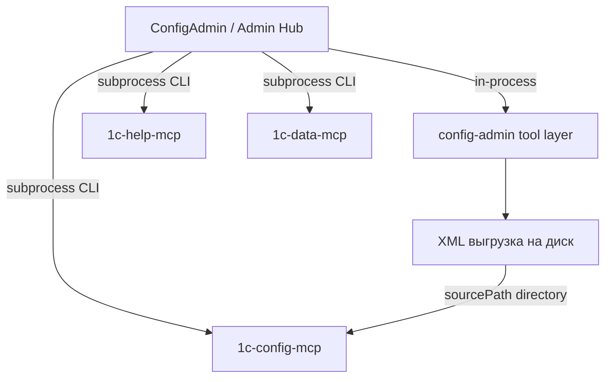

## Интеграция с Admin Hub (ConfigAdmin)

### Статус

- **Протокол:** v1 + addendum v1.0.1 + v1.0.2 (см. [`protocol-v1.md`](protocol-v1.md) и addendum в этом каталоге).

- **Роль:** ConfigAdmin = **Admin Hub implementation** + managed tool `config-admin` (v1.0.2 §1, §12).

- **config-mcp Phase 1 (ConfigAdmin side):** **готово** — Hub tables в SQLite, экран MCP, sync через `apply-registry`, post-export sync.

- **Registry mapping (Hub ↔ config-mcp):** **согласовано 2026-06-28** — см. [`registry-mapping.md`](registry-mapping.md).

- **ConfigAdmin protocol CLI** (inventory/status/export-registry для самого Hub): не начато.

- **Режим по умолчанию:** standalone; `managed` — после явной настройки manifest.

### Роль в экосистеме

**ConfigAdmin** (`moduleType: config-admin`):

- выгрузка конфигурации и расширений в XML;

- хранение профилей клиентов/баз в `configadmin.db`;

- canonical Hub registry (clients, projects, infobases, tool_instances, links) — по v1.0.2;

- orchestration headless-операций внешних MCP (config-mcp: inventory/status/apply-registry).

MCP-модули остаются отдельными portable instances; интеграция — manifest + CLI, не merge codebase.

### Принципы разработки

1. **Minimum invasive unification** — расширять `ConfigAdmin.Console` и `Application/Hub/`, не переписывать `ExportOrchestrator`.

2. **CLI entrypoint** — существующий `configadmin.exe`, без нового exe.

3. **In-process для себя** — Hub-операции ConfigAdmin через DI/services; MCP — subprocess (v1.0.2 §6).

4. **GUI не центр интеграции** — WPF для человека; Hub/automation — CLI (Phase 2+).

5. **NO_DB_MIGRATIONS** — см. [`../database.md`](../database.md); без конвертации данных, bootstrap схемы допустим.

6. **Manifest — source of truth для путей** — `module.manifest.json` в portable root config-mcp.

7. **Секреты** — не в registry fragment; `passwordRef` или local vault blob.

### Текущее состояние vs протокол

| Компонент | Статус |

|-----------|--------|

| Headless CLI (export, profiles, list-runs) | **готово** |

| Hub tables в SQLite (`projects`, `tool_instances`, infobase links) | **готово** |

| WPF экран «MCP конфигураций» | **готово** |

| config-mcp `inventory` / `status` / `apply-registry` (subprocess) | **готово** |

| Post-export sync + `followUpOperations` UI hint | **готово** |

| `module.manifest.json` для ConfigAdmin | не начато |

| ConfigAdmin `inventory --json` / `status --json` | не начато |

| ConfigAdmin `export-registry` / `apply-registry` | не начато |

| JSON stdout для ConfigAdmin CLI | не начато |

| Export/registry locks | не начато |

| Orchestration `rebuild-index` (CLI Phase 3 config-mcp) | не начато (только UI hint) |

Portable config-mcp (проверенный путь): `C:\1c_config_mcp_server_Portable`. CLI `--json` stdout: **UTF-8 без BOM** (protocol v1.0.3).

### Ownership (config-admin)

По addendum §8.5, §11.4, v1.0.2 §4, §7.

| Master (Hub) | Local (tool) |

|--------------|--------------|

| clientId, infobaseId, names, export plan | vault state, encrypted_password |

| exportRootPath, connection (без plain password) | export_runs, runs/, Serilog |

| cross-module links (`config_mcp_project_id` на Client — целевое; на infobase — R1) | export locks |

| platformVersion (canonical) | |

| platformPath (per-infobase, ConfigAdmin-owned) | |

`lastExportAt` / `lastExportStatus` — write-back через observational-reconcile.

### Согласованный mapping (config-mcp)

**Статус:** agreed 2026-06-28. **Канон:** [`registry-mapping.md`](registry-mapping.md).

Кратко:

- **config-mcp `project`** ≈ **Hub Client** (1:1; имя `project` в JSON не переименовываем).
- **config-mcp `database`** = одна **выгрузка** (base или extension), не инфобаза 1С целиком.
- **`infobaseId` в fragment** = id выгрузки (`ConfigurationExport.id`), не `infobases.id`.
- **Hub `projects` (SQLite)** не материализуется в `projects.json`.
- **Целевой fragment:** один project на Client, N `databases[]`, patch после export.
- **H6** (`rebuild-index` orchestration): после P0 CLI config-mcp.

Архив: [`registry-mapping-config-mcp-response-2026-06-28.md`](registry-mapping-config-mcp-response-2026-06-28.md), [`registry-mapping-hub-response-2026-06-28.md`](registry-mapping-hub-response-2026-06-28.md).

### Registry fragment (config-mcp) — **R1, переходный**

`ConfigMcpFragmentBuilder` сейчас (до registry R2):

- `projectId` = `infobases.config_mcp_project_id` → **целевое:** `clients.config_mcp_project_id`
- `clientId` = `clients.id`
- `infobaseId` = `infobases.id` → **целевое:** `ConfigurationExport.id` per export
- одна database, только «Основная конфигурация`

CLI: `Tools/1c-config-cli.exe --root "<portable>" apply-registry --input fragment.json --json`

### Точки интеграции в коде

| Слой | Путь |

|------|------|

| Hub sync | `src/ConfigAdmin.Application/Hub/` |

| MCP CLI runner | `src/ConfigAdmin.Infrastructure/Hub/JsonCliRunner.cs` |

| Repositories | `ToolInstanceRepository`, `HubProjectRepository`, `InfobaseRepository` |

| WPF | `ConfigMcpView`, `ConfigMcpViewModel`, `ExportViewModel` (post-export) |

| Profiles | `ProfileService`, repositories |

| Export | `ExportOrchestrator`, `ExportService` |

| Paths / DB | `AppPaths`, `DatabaseInitializer` |

### Reference workflow (export → config-mcp)

1. Выгрузка конфигурации (WPF или CLI export) **или** Remote Sync complete на Hub

2. Hub обновляет `sourcePath` через `apply-registry` fragment

3. `apply-registry` → config-mcp `projects.json`

4. **`rebuild-index`** — парсинг XML в index db config-mcp (целевой полный цикл)

5. Сейчас шаг 4: только `followUpOperations` hint в UI; автоматический вызов — **Phase 3** (Admin Hub protocol)

### План внедрения

См. [`../todo.md`](../todo.md). Кратко:

- **Phase 1 (config-mcp):** done — Hub tables, MCP screen, apply-registry sync

- **Phase 2:** ConfigAdmin protocol CLI, registry export, locks

- **Phase 3:** help-mcp / data-mcp, rebuild orchestration

### Protocol deviation

Отклонения документировать по §16 protocol v1. Планируемые:

| Deviation | Reason | Workaround |

|-----------|--------|------------|

| `dataDir` default `%AppData%` | исторический layout | `CONFIGADMIN_DATA_DIR` |

| `list-runs` вместо `operations.log` на Phase 1 | journal уже в SQLite | functional equivalence |

| `rebuild-index` не orchestrated | CLI Phase 3 config-mcp | UI hint из `followUpOperations` |

| stdout JSON in CP1251 (legacy portable) | старый config-mcp CLI | обновить portable до UTF-8 fix |

