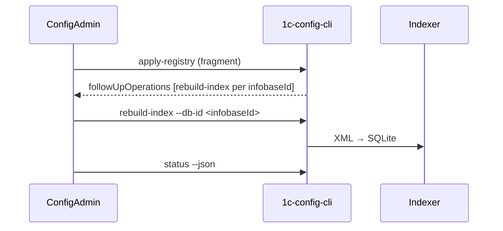

# Ответы команды 1c-config-mcp: `project`, registry и Admin Hub

**Дата ответа:** 2026-06-28  
**Статус:** **agreed** — Hub подтвердил без возражений (см. [`registry-mapping-hub-response-2026-06-28.md`](registry-mapping-hub-response-2026-06-28.md))  
**Канон:** [`registry-mapping.md`](registry-mapping.md)

Ответы основаны на коде config-mcp (`shared/project_manager.py`, `shared/registry_apply.py`, `shared/source_path.py`).

---

## Блок 1. Семантика `project` в config-mcp

### 1.1. Что для вас означает `project` в реальной работе?

**Контейнер видимости для MCP и группировка индексов**, а не «проект разработки» в смысле задачи/спринта.

На практике:

- В `projects.json` — верхний уровень: имя, флаг `active`, список `databases[]`.
- Только базы **активных** проектов попадают в MCP (`active_databases` → `project_filter` в остальных tools).
- Один portable-экземпляр config-mcp может обслуживать несколько таких контейнеров; пользователь переключает «что сейчас видит агент в IDE».
- В standalone-режиме проект создаётся вручную в Admin GUI; в managed — материализуется Hub через `apply-registry`.

Исторически проект часто называют по **клиенту** («Трансгаз», «Ромашка»), но в модели это **группа баз с общим переключателем active**, а не обязательно 1:1 с юридическим клиентом Hub.

### 1.2. Насколько часто один `project` = один клиент (1:1)?

- [ ] Почти всегда 1:1  
- [x] **Часто 1:1, но бывают исключения** → опишите:  
- [ ] Часто один клиент → несколько project  
- [ ] Часто один project → несколько клиентов  
- [ ] Другое:  

**Исключения, которые уже осмысленны в текущей модели:**

- Один клиент → **несколько project**: разная изоляция индексов (prod vs dev), разные договоры/подрядчики, «архивный» срез конфигурации рядом с актуальным.
- Один project → **несколько клиентов**: редко и обычно ошибка именования; технически допустимо, но путает `project_filter` в MCP.

### 1.3. Бывают ли осмысленные кейсы «два project на одного клиента»?

**Да.**

| Кейс | Зачем отдельный project |
|------|-------------------------|
| Prod и dev в одном portable, но **не одновременно в MCP** | Разные `active`; агент не смешивает контексты |
| Тяжёлые конфигурации, параллельная пересборка | Меньше конкуренции за locks / `.building` в одном дереве GUI |
| Исторический снимок («как было до обновления») | Отдельный индекс, не трогая рабочий |
| Разные команды / доступы (будущее) | Разграничение на уровне «что активно в MCP» |

### 1.4. Как вы сегодня называете `project` пользователям (GUI, доки)?

- **GUI:** «Проект» (`admin_tool/gui_v2.py`: «Проекты и базы данных», «Создать проект»).
- **Доки / MCP:** «проект» (`project_filter` — точное имя проекта из `active_databases`).

**Устраивает для standalone-пользователей.** В связке с Hub термин «проект» пересекается с Hub `project` (другая сущность по v1.0.2 §10) и с «задачей разработчика» — отсюда путаница. Предпочтительно **не переименовывать в UI**, а зафиксировать mapping в протоколе (см. 1.5).

### 1.5. Готовность к переименованию `project` в схеме / CLI / Admin GUI

- [ ] Да, хотим переименовать (укажите целевое имя: `client` / `workspace` / другое: ______)  
- [ ] Нет, breaking change неприемлем; достаточно документации и `clientId` в metadata  
- [x] **Готовы к alias: старое имя в JSON + новое поле, deprecation period: не раньше Phase 4 hub, если вообще**  
- [ ] Нужно обсудить отдельно  

_Комментарий:_

**Переименование `projects` → `clients` в `projects.json` сейчас нецелесообразно.**

Причины:

- Breaking change для portable-установок, GUI, тестов, привычного `project_filter` в MCP (фильтр по **display name** проекта).
- Поле `clientId` уже принимается и сохраняется в `apply-registry` (`shared/registry_apply.py`).
- Имя файла `projects.json` и portable layout зафиксированы в протоколе и `build_all.bat`.

**Предложение (вариант 2 из опросника):** оставить `project` / `projects.json` как operational-имена config-mcp; в addendum явно записать:

> Hub **Client** материализуется в config-mcp как один элемент `projects[]` с заполненным `clientId`.  
> Hub **Project** (SQLite `projects`, v1.0.2 §10) **не** обязан иметь отдельный аналог в config-mcp, если не нужен продуктово.

Опционально позже: read-only alias `workspaceId` в JSON без смены ключа `projects`.

---

## Блок 2. Семантика `database` и выгрузки

### 2.1. Что для вас одна запись `database` в `projects.json`?

- [ ] Одна инфобаза 1С (вся конфигурация целиком)  
- [x] **Одна выгрузка (основная конфа или одно расширение)**  
- [ ] Один `sourcePath` независимо от привязки к базе  
- [ ] Другое:  

**Уточнение:** одна запись `database` = **один индексируемый артефакт** (один каталог выгрузки → один `*.db`). Поле `type`: `base` | `extension`. Несколько расширений одной инфобазы 1С = **несколько** записей `database` в одном `project`.

### 2.2. Как вы видите несколько расширений у одной инфобазы?

**Целевая модель: один project (клиент) → N databases.**

Пример «Ромашка / Бухгалтерия prod»:

```
project (clientId = …)
  ├─ database infobaseId=A, type=base,    sourcePath=…/Основная конфигурация
  ├─ database infobaseId=B, type=extension, name=ФТ_Доработки, sourcePath=…/Расширение1
  └─ database infobaseId=C, type=extension, name=…, sourcePath=…/Расширение2
```

**Текущие ограничения:**

| Область | Статус |
|---------|--------|
| Схема `projects.json`, GUI (`type` base/extension) | **есть** |
| Парсер / индекс для расширений | **работает** (отдельный `Configuration.xml` в каталоге расширения) |
| Hub `ConfigMcpFragmentBuilder` | **только основная** (R1); multi-export — на стороне Hub |
| `apply-registry` | принимает несколько `databases[]` в одном project **уже сейчас** |

Отдельный project на каждое расширение — **не** целевая модель (усложняет `active` и MCP).

### 2.3. Поддержка `sourceKind: directory` vs archive/xml

| `sourceKind` | Статус config-mcp | Что слать Hub |
|--------------|-------------------|---------------|
| `directory` | **стабильно** (Phase 2): `sourcePath` = каталог с `Configuration.xml` (или `Ext/Configuration.xml` для части расширений) | Канонический layout из `integration.md` § Remote Sync: `…/{BaseName}/Основная конфигурация/` |
| `archive` | **не поддержан**: apply → skip + warning (`shared/source_path.py`) | Не слать до Phase 3+; либо распаковка на Hub до directory |
| legacy `sourceXml` | нормализуется при export/status | **не слать** (v1.0.2) |

Entry point: `shared/source_path.resolve_configuration_xml`.

### 2.4. Нужен ли отдельный стабильный id на уровне «выгрузка / расширение»?

**Для `apply-registry` достаточно `infobaseId` + `type` + `sourcePath`** при правиле: один logical export configuration instance → один `infobaseId` в Hub.

**Полезно добавить в fragment (опционально, observational / будущее):**

- `exportId` / `configurationTemplateId` — для трассировки и reconcile в Hub;
- явное имя расширения (`extensionName` или стабильный `name` database) — уже есть как `name`.

config-mcp **не** должен становиться source of truth для export lifecycle; Hub хранит `isCurrent` / hash, config-mcp — `indexStatus` и mtime источника.

---

## Блок 3. Registry, `apply-registry` и authoritative IDs

### 3.1. Согласны ли с v1.0.2 §10: lifecycle `projectId` / привязка к Hub — на стороне ConfigAdmin?

- [ ] Да  
- [x] **Частично** → уточните:  
- [ ] Нет → предложите модель:  

**Согласны по сути:** canonical UUID (`clientId`, `projectId`, `infobaseId`) генерирует Hub; config-mcp **не** подменяет их локальными id при apply (`registry_apply` upsert по `projectId` / `infobaseId`).

**Нужно согласовать терминологию Hub `project` vs config-mcp `project`:**

- v1.0.2 §10: `project` — **Hub-only** canonical entity в `configadmin.db`.
- В config-mcp `projects[]` — **materialized view** для индекса и MCP, не обязательно 1:1 с таблицей Hub `projects`.

**Вопрос к Hub:** планируется ли связь Hub `Client` → Hub `Project` → `Infobase` → config-mcp, или целевой mapping **Client → config-mcp project** (один уровень), а Hub `projects` остаётся внутренним? От этого зависит, что класть в `projectId` fragment.

**Текущее поведение Hub (R1):** один fragment ≈ один config-mcp project с одной database — это **упрощение transport**, не целевая гранулярность.

### 3.2. Предпочтительная гранулярность fragment от Hub

- [x] **На одну инфобазу / один export** (минимальный patch при каждом export) — *как сейчас в builder*  
- [x] **Допустимо и желательно для batch:** на одного клиента (все databases одного config-mcp project в одном fragment)  
- [ ] На один export / один template *(эквивалент первому пункту)*  
- [ ] Идемпотентный upsert по `infobaseId` + `sourcePath` без жёсткой привязки к «одному project»  
- [ ] Другое:  

**Норматив:** `apply-registry` mode `patch` (default) — идемпотентный upsert; **не** требует полного snapshot клиента.

Рекомендация Hub: после export — fragment с **изменёнными** `databases[]`; периодически — полный fragment клиента для reconcile. `snapshot` mode у нас есть, но для auto-sync после каждого export избыточен.

### 3.3. Если MCP-project = клиент: как маппить `databases[]`?

**Клиент «Ромашка»** (`clientId = c-romashka`), базы «Бухгалтерия prod», «Бухгалтерия dev», у prod — основная + 2 расширения:

| Сущность | id | config-mcp |
|----------|-----|------------|
| 1× project | `projectId` = Hub-назначенный UUID (или = `clientId` — **нужно решение Hub**) | `projects[].id`, `clientId: c-romashka`, `name: "Ромашка"`, `active: true` |
| 5× database | по одному `infobaseId` на каждый export | см. ниже |

```
databases[]:
  { infobaseId: ib-prod-base,    name: "Бухгалтерия prod",       type: base,      sourcePath: …/prod/Основная конфигурация }
  { infobaseId: ib-prod-ext1,   name: "Бухгалтерия prod / ФТ1", type: extension, sourcePath: …/prod/Расширение1/… }
  { infobaseId: ib-prod-ext2,   name: "… / ФТ2",                type: extension, sourcePath: … }
  { infobaseId: ib-dev-base,    name: "Бухгалтерия dev",        type: base,      sourcePath: …/dev/Основная конфигурация }
```

**Не** делать отдельный config-mcp project на каждую инфобазу (текущий R1-builder) — только как переходный этап.

### 3.4. Какие поля fragment обязательны / опциональны

**Обязательные (apply без них не имеет смысла):**

| Поле | Уровень |
|------|---------|
| `projectId` | project |
| `infobaseId` | database |
| `name` | оба (fallback `Unnamed`) |
| `sourcePath` + `sourceKind` | database, если обновляем источник |
| `type` (`base` \| `extension`) | database при create |

**Настоятельно рекомендуемые:**

| Поле | Зачем |
|------|--------|
| `clientId` | authoritative связь с Hub Client, reconcile |
| `active` | управление видимостью в MCP |
| `platformVersion` | metadata, будущие проверки совместимости |

**Опциональные / export-only (observational):**

| Поле | Поведение config-mcp |
|------|----------------------|
| `indexStatus` | export в `export-registry` / `status`; apply **не** перезаписывает как master |
| теги, `extensionName` | можно хранить в `projects.json` если появятся в схеме; пока не используются в логике |

### 3.5. Что Hub не должен писать в registry

**Подтверждаем** (local-owned):

- `db_file`, пути к `databases/*.db`
- содержимое SQLite, `PRAGMA user_version`
- маркеры `.building`, `.tmp`, lock-файлы
- `source_xml` (derived; Hub шлёт только `sourcePath` + `sourceKind`)

---

## Блок 4. Индексация и операции после export

### 4.1. Целевой workflow после обновления `sourcePath` на Hub

**Канонический цикл** (protocol v1.0.2 §13.1, наш Phase 3):



- **Инициатор rebuild:** Hub (orchestration), не config-mcp MCP server.
- **Гранулярность:** **один `rebuild-index` на одну database** (`infobaseId`); при batch export — очередь/пул на стороне Hub.
- **`--trigger-rebuild` на apply:** допустим optional shortcut (Phase 3 backlog), но Hub orchestration остаётся primary.

**Сейчас:** `apply-registry` уже возвращает `followUpOperations`; **CLI `rebuild-index` ещё нет** — rebuild вручную через Admin GUI.

### 4.2. `rebuild-index` по directory: текущий статус

| Компонент | Статус |
|-----------|--------|
| Индексация из directory (`source_kind=directory`) | **готово** (GUI / `DatabaseManager`) |
| Headless `rebuild-index` CLI | **в работе / P0** (`hub-protocol-phase-3` в todo) |
| `rebuild-all`, `reconcile-markers` | Phase 3 |
| Большие выгрузки (10–20+ мин) | работает, но без прогресса в CLI; узкое место — формы/BSL (см. `gui-build-log-timings` в todo) |

### 4.3. Нужны ли сигналы «export устарел» / `contentHash` / `isCurrent`?

**Желательно на стороне Hub** для orchestration и UI; **для config-mcp не обязательны** в fragment.

Достаточно локально:

- сравнение mtime/наличия `sourcePath` vs индекс;
- `indexStatus.isOutdated` (`INDEXER_VERSION`);
- `indexStatus.isBuilding` (маркер `.building`).

Если Hub пришлёт `contentHash` — можем отображать в `status --json` как observational, без влияния на apply.

### 4.4. Concurrent access

- Locks **per database file** (`.building`, stale detection в GUI).
- Hub при параллельном Remote Sync + локальном export: **очередь rebuild по `infobaseId`**, не два rebuild на одну database.
- Разные databases одного project — **можно параллелить** с осторожностью (CPU/IO); разумный default Hub — 1–2 concurrent rebuild.
- `apply-registry` atomic write `projects.json` — короткая критическая секция; не смешивать с длинным rebuild в одном процессе без необходимости.

---

## Блок 5. Roadmap config-mcp

### 5.1. Ближайшие 1–3 месяца

| Приоритет | Задача |
|-----------|--------|
| **P0** | `hub-protocol-phase-3`: `rebuild-index`, `rebuild-all`, `reconcile-markers` — разблокирует Remote Sync E2E |
| **P1** | `status --json`: явнее «source на диске есть / index отсутствует / index актуален» |
| **P1** | `gui-bulk-update` (общий code path с `rebuild-all`) |
| **P2** | `hub-protocol-phase-2-ops`: `operations.log` |
| **Параллельно** | парсер/MCP: `form-dynamiclist-settings`, dependency-layer фазы 4–5 (blocked на выгрузках) |

**Не в ближайшем scope:** rename `project`, смена layout `projects.json`, archive `sourceKind`.

### 5.2. Breaking changes

| | |
|-|-|
| **Точно не хотим** | rename `projects`/`project` в JSON и CLI; смена portable layout; MCP tools для control-plane; SQLite migrations |
| **Допустимо при явном major** | новые optional поля в `projects.json`; alias-поля; расширение fragment schema |
| **Точно хотим** | headless rebuild CLI; multi-database fragment от Hub (без смены схемы — уже поддержано) |

### 5.3. Что нужно от Hub в первую очередь

1. **Целевой fragment:** один config-mcp project на **Client**, N databases (base + extensions) — вместо 1:1:1 в `ConfigMcpFragmentBuilder`.
2. **Orchestration Phase 3:** после apply выполнять `followUpOperations` (`rebuild-index`).
3. **Стабильный `clientId`** в каждом fragment + документированное правило для `projectId`.
4. **`status --json` readiness** per database (можем доработать с нашей стороны; Hub должен уметь интерпретировать).
5. Multi-export / extensions в export pipeline (R2) — без этого registry не отражает реальность.

Webhook/event — nice to have; для MVP достаточно polling `status` после rebuild.

---

## Блок 6. Согласование терминов (итоговая таблица)

| Термин Hub | Термин config-mcp | Соотношение | Примечание |
|------------|-------------------|-------------|------------|
| **Client** | `projects[]` (элемент) | **1:1** (целевое) | `clientId` на project; имя `name` для людей и `project_filter` |
| **Infobase** | не отдельная сущность | 1:N | Одна инфобаза → 1..N databases (base + extensions) |
| **ConfigurationExport** (`sourcePath`) | `database.source_path` + `source_kind` | **1:1** | Одна запись database на один export/template instance |
| **ConfigurationTemplate** (будущее) | `database.type` + `name` (+ optional template id в metadata) | N:1 | Template не требует отдельной таблицы в config-mcp |
| **Hub `projects`** (SQLite, §10) | *нет прямого аналога* | опционально | Внутренняя сущность Hub; в fragment — только если нужна продуктово, иначе только `clientId` |
| **Task** (разработка) | *нет* | — | Вне scope config-mcp |

---

## Блок 7. Процесс и контакты

### 7.1. Удобный формат ответа

- [x] **Async: отдельный файл** (этот документ)  
- [ ] Созвон: предложите слоты  
- [ ] Issue / PR в репозитории config-mcp  

### 7.2. Ответственный с вашей стороны

_Имя, канал связи:_

```
[заполнит владелец репозитория / команда]
```

### 7.3. Желаемый срок ответа

```
Готовы к async-согласованию сразу; созвон 30–45 мин — по запросу после прочтения.
Для backlog Hub: зафиксировать mapping в addendum в течение 1–2 недель после взаимного ОК по таблице §6.
```

---

## Вопросы к Hub — **закрыты 2026-06-28**

Ответы Hub: [`registry-mapping-hub-response-2026-06-28.md`](registry-mapping-hub-response-2026-06-28.md). Итог в каноне: [`registry-mapping.md`](registry-mapping.md).

<details>
<summary>Исходные вопросы (архив)</summary>

1. **Hub `project` vs config-mcp `project`:** → config-mcp project = Hub Client; Hub `projects` не в `projects.json`.
2. **`projectId`:** → на Client (`clients.config_mcp_project_id`); auto-sync.
3. **`infobaseId`:** → отдельный id per export (`ConfigurationExport.id`).
4. **Rename:** → не делаем.
5. **Phase 3:** → Hub multi-database параллельно; H6 после P0 CLI.

</details>

---

## Ссылки

- [`registry-mapping.md`](registry-mapping.md) — канон
- [`integration.md`](integration.md)
- [`protocol-v1.0.2-addendum.md`](protocol-v1.0.2-addendum.md) §5, §10, §13
