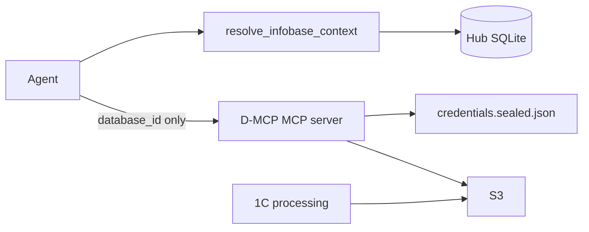

# Согласованный mapping: Hub ↔ data-mcp

**Статус:** **agreed** — Sub `protocol_ack` **2026-07-01** (`20260701T172000`) on merge `20260701T170000`  
**Переговоры:** dispute `20260701T161500` → merge `20260701T170000` → ack `20260701T172000`

**Связанные документы:**

- [`integration.md`](integration.md) — роль Hub
- [`../group/shared/protocol-v1.0.4-addendum.md`](../group/shared/protocol-v1.0.4-addendum.md) — §10.3 extension (D3)
- [`../group/shared/protocol-v1.0.1-addendum.md`](../group/shared/protocol-v1.0.1-addendum.md) §8.4, §11.3
- [`registry-mapping.md`](../group/shared/registry-mapping.md) — аналог config-mcp (2026-06-28)
- [`../domain-model.md`](../domain-model.md) — `resolve_infobase_context`

---

## Резюме

- **data-mcp `databaseid`** — operational pairing ID от 1С; Hub `dataConnectionId` + `Infobase.id`.
- **Глобальный bucket profile** — один профиль S3 на portable instance.
- **S3 keys** — только **`credentials.sealed.json`** (encrypted D-MCP password). Hub **не** хранит ключи в SQLite.
- **D-MCP password** — в Hub (`encrypted_dmcp_password`, vault) **только в `managed` mode**; для admin UI read/write sealed file; **не** агенту.
- **Агент** — refs через `resolve_infobase_context`; D-MCP tools с `database_id` only.
- **Pairing** — 1С processing first-run; Hub записывает mapping после paste.
- **Режимы** — `standalone` (полный compact UI) vs `managed` (Hub authoritative, local read-only).

---

## Архитектура слоёв



| Слой | Ответственность |
|------|----------------|
| **Agent** | Refs из Hub; MCP calls с `database_id` |
| **Hub context tool** | SQLite only — **без** sealed file |
| **Hub D-MCP settings** | Admin → `credentials.sealed.json` + `apply-registry` |
| **D-MCP server** | S3 transport; keys из sealed file в памяти (unlock at startup) |
| **1C processing** | Pairing; отдельные S3 keys в 1С |

---

## Таблица терминов

| Термин Hub | Термин data-mcp | Соотношение |
|------------|-----------------|-------------|
| **Infobase** | — | 1:1 data connection |
| **dataConnectionId** | — | canonical UUID |
| **databaseid** (fragment) | `database_id` (tools, S3) | 1:1 |
| **Global bucket** | `yandex` в config | 1:1 per portable |

**Dual JSON naming:** fragment `databaseid` (lowercase); context tool `databaseId` (camelCase).

**Не путать:** `databaseid` ≠ config-mcp fragment `infobaseId` (`ConfigurationExport.id`).

---

## Ownership matrix

| Данные | Hub SQLite | `config.local.json` | `credentials.sealed.json` | Agent |
|--------|------------|---------------------|---------------------------|-------|
| `dataConnectionId`, mapping | да | patch via apply | — | refs |
| Global bucket metadata | да | да | — | нет |
| S3 access keys | **нет** | **нет** plaintext | да (encrypted) | **нет** |
| D-MCP password | `encrypted_dmcp_password` (managed) | — | unlock key | **нет** |
| Timeouts, limits | нет | да | — | нет |

---

## Режимы: standalone vs managed

| | `standalone` | `managed` |
|---|--------------|-----------|
| Источник правды config | compact UI / local | Hub |
| Hub D-MCP password | не требуется | хранится (vault) |
| Compact UI | полный first-run (bucket, keys, connections) | **read-only** metadata + connections; lock state |
| Edit S3 keys locally | да | **нет** (только Hub UI) |
| Break-glass | N/A | `--standalone-override` или marker file (оператор) |

**D-MCP password в Hub** — только при явном `managed` на `tool_instance`. Standalone portable never requires Hub to possess D-MCP password.

---

## Pairing (1С processing)

1. 1С генерирует `database_id`, пишет `_meta.json` (`onec-processing-v1.md`).
2. User paste в Hub → `data_connections.databaseid`.
3. Hub `apply-registry` patch.

Hub v1 не генерирует `database_id`. Ротация keys в sealed file **не** синхронизирует 1С автоматически.

---

## Секреты: D-MCP password и `credentials.sealed.json`

### Три уровня

| Уровень | Что | Разблокировка |
|---------|-----|---------------|
| 1 | Hub vault | Мастер-пароль |
| 2 | D-MCP password | Уровень 1 (managed admin) |
| 3 | S3 keys в sealed file | D-MCP password |

### Кто нуждается в D-MCP password

| Актор | Нужен? |
|-------|--------|
| Agent | **Нет** |
| Hub context tool | **Нет** |
| Hub D-MCP settings (managed) | **Да** |
| D-MCP MCP server (startup) | **Да** |

### Файл `credentials.sealed.json` (merged D1)

- Путь: `config.local.json` → `"credentials_file": "credentials.sealed.json"` (default).
- Hub `sealed_secrets_path` default: `credentials.sealed.json`.

**Внешний JSON:**

```json
{
  "schemaVersion": 1,
  "kdf": "argon2id",
  "kdfParams": {
    "salt": "<base64 16 bytes>",
    "memorySize": 65536,
    "iterations": 3,
    "parallelism": 4
  },
  "cipher": "aes-256-gcm",
  "payload": "<base64: nonce(12) + tag(16) + ciphertext>"
}
```

**Plaintext inside ciphertext:**

```json
{"accessKeyId":"YCAJ...","secretAccessKey":"YCO..."}
```

**KDF / cipher:** совместимо с Hub [`SecretVault`](../../src/ConfigAdmin.Infrastructure/Security/SecretVault.cs).

### Cipher test vector (cross-repo)

| Field | Value |
|-------|-------|
| Password (UTF-8) | `dmcp-test-vector-password` |
| Plaintext JSON | `{"accessKeyId":"YCAJTESTKEY","secretAccessKey":"YCOSECRETTEST"}` |
| Salt (base64) | `obLDNNXnBweSmkte1jjvkA==` |
| Nonce (hex) | `0102030405060708090a0b` |
| KDF | memorySize=65536, iterations=3, parallelism=4 |

**Full file:**

```json
{
  "schemaVersion": 1,
  "kdf": "argon2id",
  "kdfParams": {
    "salt": "obLDNNXnBweSmkte1jjvkA==",
    "memorySize": 65536,
    "iterations": 3,
    "parallelism": 4
  },
  "cipher": "aes-256-gcm",
  "payload": "AQIDBAUGBwgJCgvOIXlJripUWNWC0lrPzEFE5TSDAr2N6ZyFtMFML/A/kjqciTYQTaWiQXjxURCkWSj0ESJtKtKG9VthK6ak+2eDwbxTKIv37i6yaUFstECY"
}
```

Phase 1: cross-repo decrypt test (D-H3 + Sub P1).

### MCP server unlock (Cursor)

| Context | Unlock |
|---------|--------|
| Production / managed | Once at **MCP server process start** (compact CLI / tray helper **outside** Cursor) |
| Dev / CI | `DMCP_PASSWORD` env or `--password-stdin` — **dev-only** |
| Per MCP tool call | **Rejected** |

### Protocol deviation (§16)

- `credentials.local.json` → `credentials.sealed.json`
- Hub stores D-MCP unlock password (not S3 keys) — normative: v1.0.4 addendum §2

---

## Global bucket profile

Один профиль на `tool_instances` (`module_id = 1c-data-mcp`). Per-connection — только `databaseid` + `displayName`.

---

## Hub SQLite (Phase 1)

```
data_mcp_settings
  - tool_instance_id, endpoint, region, bucket, default_prefix
  - sealed_secrets_path  (default: credentials.sealed.json)
  - encrypted_dmcp_password BLOB  (managed only)

data_connections
  - id, infobase_id, databaseid, display_name
```

---

## Fragment `apply-registry`

Metadata only (§8.4). Default **`patch`**. Post-apply: `validate-config`, `ping --database-id`.

---

## Agent context tool: `resolve_infobase_context`

Hub capability. **Refs only** — no credentials, no D-MCP password. Vault unlock **not** required.

```json
{
  "infobaseId": "uuid",
  "infobaseName": "Бухгалтерия prod",
  "clientName": "Ромашка",
  "configMcp": {
    "projectId": "uuid",
    "projectName": "Ромашка",
    "instances": [
      { "databaseId": "export-uuid", "displayName": "Основная конфигурация", "type": "base" }
    ]
  },
  "dataMcp": {
    "dataConnectionId": "uuid",
    "databaseId": "a1b2c3d4",
    "paired": true
  }
}
```

---

## Hub D-MCP settings UI (Phase 1)

1. Unlock Hub vault.
2. Managed: store D-MCP password → `encrypted_dmcp_password`.
3. Edit bucket, connections, S3 keys.
4. Save → `credentials.sealed.json` + `apply-registry` + optional `ping`.

---

## Backlog Head

| ID | Задача | Статус |
|----|--------|--------|
| D-H6 | Mapping doc + merge | **done** (2026-07-01) |
| D-H1 | SQLite schema | **ready** |
| D-H2 | WPF D-MCP settings | **ready** |
| D-H3 | Sealed file R/W + test vector | **ready** |
| D-H4 | DataMcpSyncService | **ready** |
| D-H5 | `resolve_infobase_context` | **ready** |

---

## Backlog data-mcp Sub

| P | Задача |
|---|--------|
| P1 | `protocol_ack` на merge |
| P1 | manifest, inventory/status/validate-config CLI |
| P1 | `credentials.sealed.json` + startup unlock |
| P1 | export/apply-registry (metadata) |
| P2 | apply-secrets CLI (optional) |
| P2 | deprecate plaintext credentials in portable build |

---

## Merge record (D1–D3)

| ID | Resolution |
|----|------------|
| **D1** | **`credentials.sealed.json`** (Sub counter accepted) |
| **D2** | Managed: compact UI read-only; standalone: full UI; break-glass documented |
| **D3** | [`protocol-v1.0.4-addendum.md`](../group/shared/protocol-v1.0.4-addendum.md) |

---

## Ответ Sub

| Поле | Значение |
|------|----------|
| Статус | `ack` (`20260701T172000`) |
| Дата | 2026-07-01 |
| Комментарий | Core architecture accepted; D1–D3 raised |
| Dispute items | D1 filename, D2 managed UI, D3 §10.3 wording |
| Head merge | `20260701T170000` — all three resolved per table above |
| Sub ack | **received** `20260701T172000` (2026-07-01) |

---

*После Sub `protocol_ack` — начать Phase 1 implementation.*
