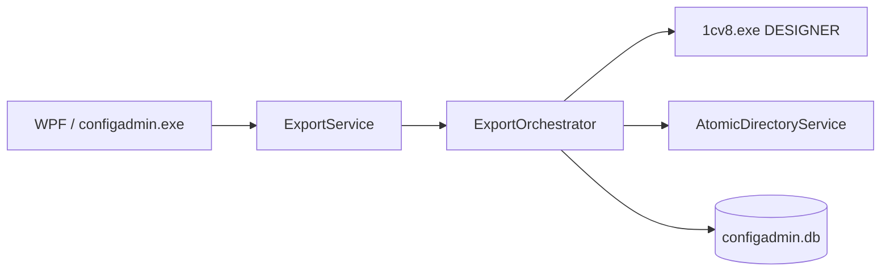

## Архитектура

### Назначение

ConfigAdmin хранит профили клиентов и инфобаз 1С, выполняет пакетную выгрузку конфигурации и расширений в XML и ведёт журнал запусков. Выгрузка пригодна для MCP конфигураций и других инструментов, работающих с исходниками на диске.

### Слои решения

| Проект | Назначение |
|--------|------------|
| `ConfigAdmin.Domain` | Модели, enum, интерфейсы репозиториев и сервисов |
| `ConfigAdmin.Application` | `ExportOrchestrator`, `ProfileService`, `ExportService`, vault-сессия |
| `ConfigAdmin.Infrastructure` | SQLite (Dapper), `SecretVault`, пути, atomic replace каталогов |
| `ConfigAdmin.Integration.OneC` | `OneCCliAdapter`, `OneCCommandBuilder`, `ProcessRunner` |
| `ConfigAdmin.Console` | CLI (`System.CommandLine`) |
| `ConfigAdmin.Wpf` | Desktop UI (MVVM) |

WPF и Console используют один DI-контур: `AddConfigAdminApplication()`.

### Поток выгрузки



1. Загрузка профиля базы и клиента из SQLite.
2. Расшифровка пароля базы (если vault unlocked).
3. Шаги: основная конфигурация → все расширения или выбранные.
4. Каждый шаг — subprocess `1cv8.exe` с `/DumpConfigToFiles`, `/Out`, `/DumpResult`. См. [`onec-cli-reference.md`](onec-cli-reference.md).
5. Temp-каталог → atomic replace целевых каталогов в `{ExportRoot}`.
6. Запись `export_runs` и артефактов в `%AppData%\ConfigAdmin\runs\`.

### Каталоги данных

**Выгрузка (пользовательский арtefact):**

```text
{ExportRoot}/{ClientName}/{BaseName}/
  Основная конфигурация/
  {ИмяРасширения}/
```

**Служебные данные приложения:**

```text
%AppData%\ConfigAdmin/
  configadmin.db
  logs/
  runs/{Client}/{Base}/{runId}/
    export-meta.json
    {step}.out.log
    {step}.dumpresult
```

### Admin Hub (направление)

Canonical Hub model персистится в `configadmin.db` (protocol v1.0.2). Orchestration внешних MCP — subprocess по `module.manifest.json`. См. [`admin-hub/integration.md`](admin-hub/integration.md).

### Remote Sync

Доставка XML с RDP на локальный `{ExportRoot}`; MCP локально. Один exe, режимы **Админка** | **Передатчик**; HTTPS chunk upload с докачкой.

**Phase R-Ping готово** (register/heartbeat, Tailscale Funnel, E2E с RDP). Upload — в работе (R1).

Код: `src/ConfigAdmin.Application/RemoteSync/`, WPF: `HubModeSelectorView`, `RemoteNodesView`, `SyncAgentView`.

Документация: [`remote-sync/README.md`](remote-sync/README.md), статус: [`remote-sync/status.md`](remote-sync/status.md).

### Тесты

Unit-тесты: `tests/ConfigAdmin.Tests` — orchestrator, command builder, vault, log reader.

```powershell
dotnet test tests/ConfigAdmin.Tests
```
