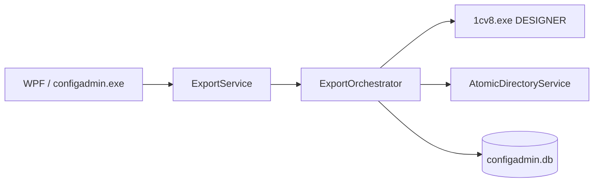

## Architecture

### Purpose

ConfigAdmin stores client and 1C infobase profiles, performs batch export of configuration and extensions to XML, and maintains a run journal. Export output is suitable for configuration MCP and other tools working with on-disk sources.

### Solution layers

| Project | Purpose |
|---------|---------|
| `ConfigAdmin.Domain` | Models, enums, repository and service interfaces |
| `ConfigAdmin.Application` | `ExportOrchestrator`, `ProfileService`, `ExportService`, vault session |
| `ConfigAdmin.Infrastructure` | SQLite (Dapper), `SecretVault`, paths, atomic directory replace |
| `ConfigAdmin.Integration.OneC` | `OneCCliAdapter`, `OneCCommandBuilder`, `ProcessRunner` |
| `ConfigAdmin.Console` | CLI (`System.CommandLine`) |
| `ConfigAdmin.Wpf` | Desktop UI (MVVM) |

WPF and Console share one DI container: `AddConfigAdminApplication()`.

### Export flow



1. Load infobase and client profile from SQLite.
2. Decrypt infobase password (if vault unlocked).
3. Steps: main configuration → all extensions or selected ones.
4. Each step — subprocess `1cv8.exe` with `/DumpConfigToFiles`, `/Out`, `/DumpResult`. See [`onec-cli-reference.md`](onec-cli-reference.md).
5. Temp directory → atomic replace of target directories under `{ExportRoot}`.
6. Write `export_runs` and artifacts to `%AppData%\ConfigAdmin\runs\`.

### Data directories

**Export (user artifact):**

```text
{ExportRoot}/{ClientName}/{BaseName}/
  Основная конфигурация/
  {ИмяРасширения}/
```

**Application service data:**

```text
%AppData%\ConfigAdmin/
  configadmin.db
  logs/
  runs/{Client}/{Base}/{runId}/
    export-meta.json
    {step}.out.log
    {step}.dumpresult
```

### Admin Hub (direction)

Canonical Hub model persists in `configadmin.db` (protocol v1 + addenda through v1.0.4). External MCP orchestration — subprocess per `module.manifest.json`. See [`admin-hub/integration.md`](admin-hub/integration.md).

### Remote Sync

XML delivery from RDP to local `{ExportRoot}`; MCP runs locally. Single exe, modes **Admin** | **Relay**; HTTPS chunk upload with resume.

**Phase R-Ping done** (register/heartbeat, Tailscale Funnel, E2E with RDP). Upload — in progress (R1).

Code: `src/ConfigAdmin.Application/RemoteSync/`, WPF: `HubModeSelectorView`, `RemoteNodesView`, `SyncAgentView`.

Documentation: [`remote-sync/README.md`](remote-sync/README.md), status: [`remote-sync/status.md`](remote-sync/status.md).

### Tests

Unit tests: `tests/ConfigAdmin.Tests` — orchestrator, command builder, vault, log reader.

```powershell
dotnet test tests/ConfigAdmin.Tests
```
