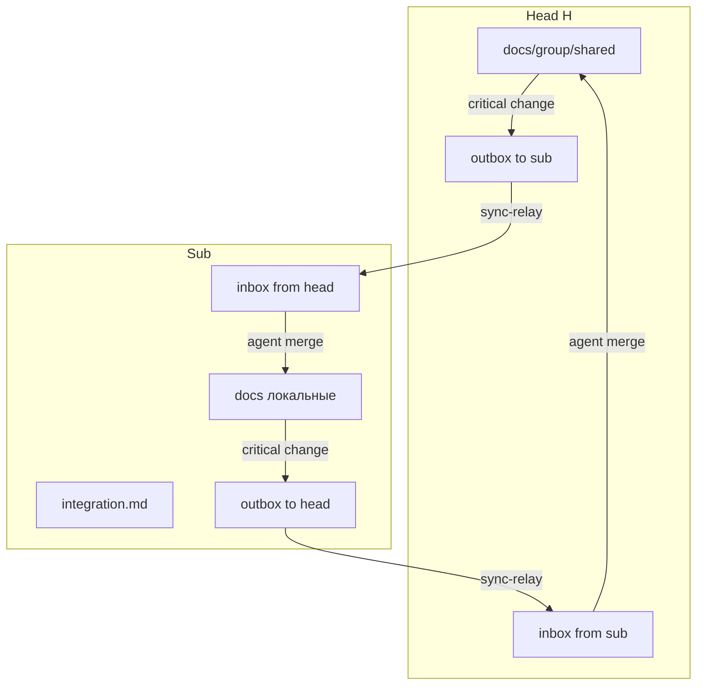

# Канон: документация

Версия: **2.1.0**

Единый порядок документации для **любого** проекта. Agent-facing материалы — **на русском** (если не оговорено иное).

---

## Уровни

---

## Корень и docs/ (все типы)

См. `project-structure.md`. Порядок чтения в `docs/README.md`:

1. `agent-onboarding.md`
2. `todo.md` — **включая необработанные пакеты в inbox**
3. `architecture.md`
4. Доменные спеки
5. Для **Sub**: `group/integration.md`

---

## Головной vs подчинённый

| Тема | Head (H) | Sub |
|------|----------|-----|
| Канон общего протокола | `docs/group/shared/` | ссылка; правки по пакетам |
| Локальная адаптация | — | `docs/` + `integration.md` |
| Карта группы | `docs/group/README.md` | ссылка в `integration.md` |
| Синхронизация | outbox/inbox per sub-id | inbox/outbox |

**Правило:** общее для группы — канон в Head `shared/`. Sub владеет **своей** версией направления в локальных спеках; обновляет их по **пакетам**, не копированием всего `shared/`.

---

## Sync-пакеты (ephemeral)

Не документация и не канон — **инструкция к правке**. Формат: `group-sync.md`, шаблон `templates/sync-packet.example.md`.

После обработки агентом (skill `process-group-inbox`) — файл **удаляется**.

---

## Политики обновления

1. Локальное изменение → доменный doc + `CHANGELOG.md`
2. Критичное для группы в Head → правка `shared/` → пакет в outbox → `sync-relay.py --deliver`
3. Критичное для общего пути в Sub → пакет в outbox → relay → Head обрабатывает inbox
4. `info`-изменения — без пакета (достаточно CHANGELOG локально)

---

## Чеклист

- [ ] Тип S/H/Sub в `agent-onboarding.md`
- [ ] inbox/outbox в `.gitignore`
- [ ] Sub: нет коммитов пакетов
- [ ] H: общие спеки только в `shared/`
