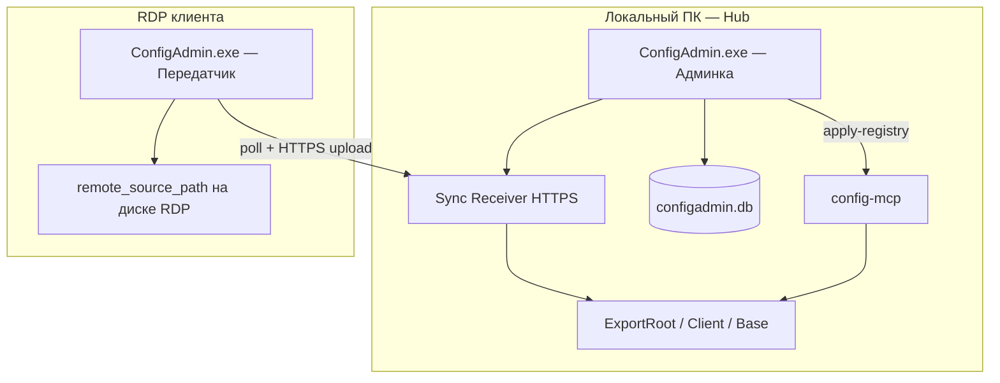
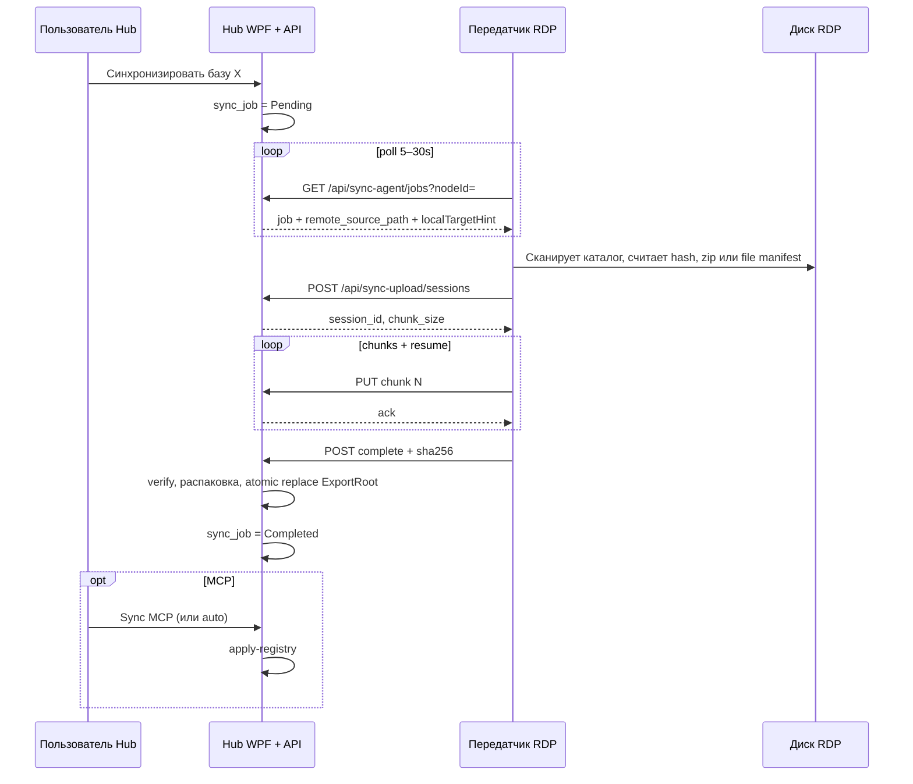

## Remote Sync — архитектура

### Контекст в экосистеме



**Принцип:** MCP читает **локальный** `sourcePath`. Remote Sync только **наполняет** этот каталог.

---

## Сущности Hub (SQLite)

### `remote_nodes` (UI: «RDP / удалённый узел»)

Каноническое имя в коде: `RemoteNodeProfile`. В интерфейсе допустимо «RDP», т.к. так пользователь мыслит площадку.

| Поле | Тип | Описание |
|------|-----|----------|
| `id` | UUID | PK |
| `client_id` | UUID | FK → `clients` |
| `name` | text | «RDP бухгалтерия», «Сервер ERP» |
| `description` | text | опционально |
| `pairing_secret_verifier` | blob | Argon2id verifier (не plain text) |
| `hub_listen_url` | text | URL приёма для agent (для справки / QR) |
| `last_seen_at` | text | ISO8601, heartbeat agent |
| `agent_version` | text | версия exe на узле |
| `enabled` | int | 0/1 |

Один клиент → **много** узлов. Одна база → **один** узел (если Remote).

### Расширение `infobases`

| Поле | Тип | Описание |
|------|-----|----------|
| `export_location` | int | `0=Local`, `1=Remote` |
| `remote_node_id` | text | FK → `remote_nodes`, nullable |
| `remote_source_path` | text | Абсолютный путь **на RDP**, напр. `D:\Exports\...\Основная конфигурация` |

Локальный путь **не храним отдельно** — вычисляется `ExportPathBuilder.GetConfigurationPath(exportRoot, client, base)`.

### `sync_jobs`

| Поле | Тип | Описание |
|------|-----|----------|
| `id` | UUID | PK |
| `infobase_id` | UUID | FK |
| `remote_node_id` | UUID | FK |
| `status` | int | см. enum ниже |
| `requested_at` | text | |
| `started_at` / `finished_at` | text | |
| `upload_session_id` | text | связь с transport |
| `bytes_total` / `bytes_received` | int | прогресс |
| `content_sha256` | text | ожидаемый hash (от agent в manifest) |
| `error_message` | text | |

**SyncJobStatus:** `Pending` → `Claimed` → `Uploading` → `Applying` → `Completed` | `Failed` | `Cancelled`

### `sync_deliveries` (журнал, опционально = денormalized view на jobs)

Для UI «история доставок»; можно объединить с `sync_jobs` в MVP.

---

## Потоки

### A. Настройка (один раз)

1. Hub: создать **клиента**, **remote node**, задать **pairing-пароль**.
2. Hub: база → Remote → выбрать node → `remote_source_path`.
3. RDP: запустить exe → **Передатчик** → URL Hub + `node_id` + pairing-пароль.
4. Agent: `POST /api/sync-agent/register` → Hub сохраняет `last_seen_at`.

### B. Синхронизация (по запросу)



### C. Обрыв связи

- Agent хранит локально `session_id` + список отправленных chunk index.
- При reconnect: `GET /api/sync-upload/sessions/{id}` → missing chunks → дослать только их.
- Spec: [`transport.md`](transport.md).

---

## Компоненты в коде

| Комponent | Проект | Статус |
|-----------|--------|--------|
| `RemoteNodeRepository` | Infrastructure | ✅ |
| `SyncAgentHubService`, `SyncReceiverHost` | Application | ✅ (ping API) |
| `SyncAgentClient`, `SyncAgentConnectionService` | Application | ✅ |
| `PublicDnsResolver` | Application | ✅ (DoH на RDP) |
| `RemoteNodeService` | Application | ✅ |
| `HubRuntimeService` | Wpf | ✅ |
| `HubModeSelectorView`, `RemoteNodesView`, `SyncAgentView` | Wpf | ✅ |
| `SyncJobRepository`, `SyncUploadSessionStore` | Infrastructure | ⬜ R1 |
| `SyncAgentService` (zip/upload/resume) | Application | ⬜ R1 |
| `RemoteSyncOrchestrator` | Application | ⬜ R1 |

Актуальный статус: [`status.md`](status.md).

---

## Связь с Admin Hub protocol

Remote Sync — **локальное расширение** ConfigAdmin, не substitute `apply-registry`.

Долгосрочно agent может стать managed tool:

```json
{
  "moduleId": "config-admin-sync-agent",
  "moduleType": "sync-agent",
  "capabilities": { "fileDelivery": true }
}
```

Protocol CLI (`inventory`, `status`) — Phase R2; MVP — private HTTPS API + WPF.

---

## Ограничения MVP

- Один каталог конфигурации за job (не все расширения в v1).
- Упаковка: **zip** всего каталога или file-tree manifest (решение в [`mvp-spec.md`](mvp-spec.md)).
- Agent должен быть **запущен** на RDP во время sync (служба — Phase R2).
- Hub Receiver слушает `:18443` (Tailscale Funnel → публичный HTTPS). См. [`network-setup.md`](network-setup.md).
