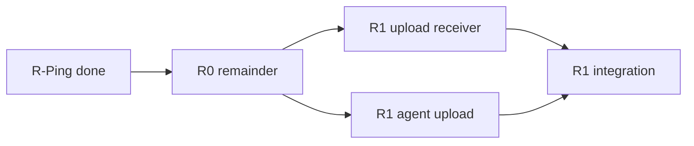

## Remote Sync — план реализации

**Предусловие:** Phase 1 config-mcp (локальный sync) — **готово**.

---

## Phase R-Ping — **готово** (2026-06-28)

**Цель:** исходящее подключение RDP → Hub без upload.

| # | Задача | Статус |
|---|--------|--------|
| R-P.1 | `remote_nodes`, `agent_sessions`, pairing | ✅ |
| R-P.2 | `SyncReceiverHost`: register, heartbeat, jobs=null | ✅ |
| R-P.3 | `SyncAgentClient` + `SyncAgentConnectionService` | ✅ |
| R-P.4 | WPF: mode selector, RemoteNodes, SyncAgentView | ✅ |
| R-P.5 | Tailscale Funnel + `network-setup.md` | ✅ |
| R-P.6 | DoH fallback для DNS на RDP (`PublicDnsResolver`) | ✅ |
| R-P.7 | E2E manual: real RDP register + heartbeat | ✅ |

---

## Phase R0 — модель (остаток)

| # | Задача | Статус |
|---|--------|--------|
| R0.1 | `remote_nodes`, `agent_sessions` | ✅ |
| R0.2 | Domain + repositories | ✅ |
| R0.3 | `sync_jobs`, поля `infobases` (Remote) | ✅ |
| R0.4 | `ExportLocation` enum, orchestrator | ✅ |

---

## Phase R1 — MVP E2E (upload)

Оценка: **2–4 недели** после R0 remainder.

### R1.A Hub — модель и UI

| # | Задача | Статус |
|---|--------|--------|
| R1.A.1 | `RemoteNodeRepository`, CRUD | ✅ |
| R1.A.2 | WPF: RemoteNodesView | ✅ |
| R1.A.3 | BaseEdit: Local/Remote, node, remote path | ✅ |
| R1.A.4 | Export: «Синхронизировать с RDP», job status | ✅ |

### R1.B Mode selector + Agent UI

| # | Задача | Статус |
|---|--------|--------|
| R1.B.1 | Startup: Hub vs Agent (+ remember) | ✅ |
| R1.B.2 | SyncAgentView — register, status, log, progress | ✅ |
| R1.B.3 | Agent settings (DPAPI token) | ✅ |

### R1.C Transport — Hub receiver

| # | Задача | Статус |
|---|--------|--------|
| R1.C.1 | Kestrel in Hub mode | ✅ |
| R1.C.2 | Agent endpoints (register/heartbeat/jobs) | ✅ |
| R1.C.3 | Upload sessions + chunks on disk | ✅ |
| R1.C.4 | Complete → unzip → atomic apply | ✅ |
| R1.C.5 | `JobCredentialsCipher`, fail job endpoint | ✅ |

### R1.D Transport — Agent client

| # | Задача | Статус |
|---|--------|--------|
| R1.D.1 | register, poll | ✅ |
| R1.D.2 | sessions, chunks, resume | ✅ |
| R1.D.3 | Export 1С on RDP (temp work dir) + zip | ✅ |
| R1.D.4 | `encryptedConnectionPassword` decrypt | ✅ |

### R1.E Integration

| # | Задача | Статус |
|---|--------|--------|
| R1.E.1 | `RemoteSyncOrchestrator` — job lifecycle | ✅ |
| R1.E.2 | Optional MCP sync after success | ✅ |
| R1.E.3 | Unit/integration tests | ✅ |
| R1.E.4 | Manual E2E [`mvp-spec.md`](mvp-spec.md) | ✅ (2026-06-28, см. [`status.md`](status.md)) |

**DoD:** код R1 + manual E2E на real RDP + 1С — **выполнено** (2026-06-28).

---

## Phase R2 — удобство

| # | Задача |
|---|--------|
| R2.1 | `configadmin.exe sync-agent` headless |
| R2.2 | Windows Service / tray, автопереподключение |
| R2.3 | Export на RDP из Hub |
| R2.4 | Multi-PC Hub / central relay (проработка) |
| R2.5 | **Live-прогресс export 1С на RDP:** poll work dir (file count + total size + elapsed) → heartbeat/Hub UI | ✅ |
| R2.6 | **Скорость upload:** baseline ~800 MB / 30+ мин через Funnel; варианты — больший chunk (16–32 MB), keep-alive, параллельные chunks (осторожно с Funnel), прямой Tailscale без Funnel в LAN, сжатие zip, метрики MB/s в UI |
| R2.7 | **Cleanup на RDP:** настройка «удалять work dir после успеха» (default on) / «оставить для отладки»; явный лог при сбое `TryCleanupWorkDir` |
| R2.8 | **UX / GUI Remote Sync:** упростить Hub (Remote-базы, job status, tunnel) и Передатчик (pairing, один экран прогресса); см. продуктовый backlog |
| R2.9 | **Полный MCP-цикл после sync:** orchestration `apply-registry` → `rebuild-index` (парсинг XML на Hub); сейчас только apply-registry + UI hint |

---

## Phase R3 — масштаб

| # | Задача |
|---|--------|
| R3.1 | Relay VPS |
| R3.2 | S3 async |
| R3.3 | Scheduled sync |

---

## Зависимости

---

## Риски

| Риск | Митигация |
|------|-----------|
| Hub недоступен с RDP | Tailscale Funnel + DoH — **проверено** |
| Корпоративный DNS | `PublicDnsResolver` (DoH) |
| Большие конфигурации | zip + chunk + resume (R1) |
| Медленный upload через Funnel | R2.6: chunk size, параллелизм, direct Tailscale, метрики |
| Несколько рабочих ПC | один канонический Hub — см. [`overview.md`](overview.md) |

*Обновлено: 2026-06-28*

